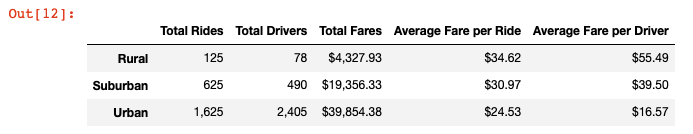
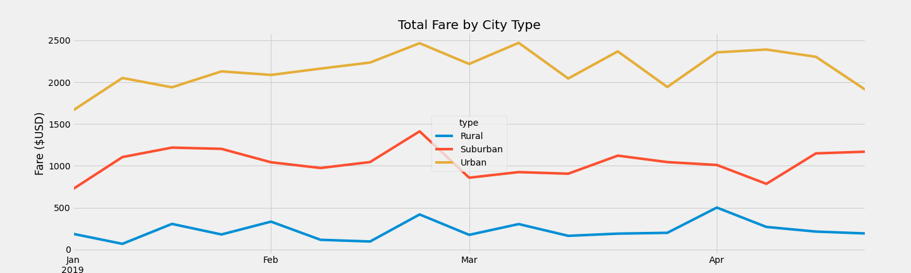

# PyBer_Analysis

## Analysis Overview

An analysis was done on ride sharing data to show how ride sharing compares between rural, suburban, and urban cities. Two deliverables were provided:

1. A dataframe that breaks down the total rides, total drivers, total fares, average fare per ride, and average fare per driver across the three city types.
2. A line graph that shows how total fares change over a period of time by city type. 

### Resources
- [ride_data_csv](Resources/ride_data.csv)
- [city_data_csv](Resources/city_data.csv)
- Software: Python 3.9.7, Pandas 1.3.4, Conda 4.11.0, Jupyter Notebooks, Visual Studio Code 1.64.2 (Universal)

## Results

The analysis showed that urban cities, which tend to have higher populations and a denser city layout, had a much higher number of total rides, drivers, and fares, and lower average fares per ride and per driver compared to rural areas. Suburban areas, which we can assume have population and housing densities in between urban and rural areas. 

### DataFrame Summary

Urban cities had **13x** as many rides on ride sharing apps versus rural areas, and **2.6x** as many as suburban areas. Urban cities also had over **30x** the number of drivers for ride sharing and collected over **9x** the money in total fares than rural areas. Suburban areas fell in between rural and urban areas for total number of drivers and total fares collected on ride sharing apps, with over **6x** the number of drivers and **4.5** the total fares of rural areas, but just **1/5** and **1/2** the number of total drivers and total fares compared to urban areas, respectively. 

 The average fare per ride was $10 more in rural areas than urban areas, and the average fare collected by the driver was **3.3x** higher in rural areas than urban areas. 

### Line Chart Summary

The total fares per week by city type (rural, suburban, urban) between the period of January 1st - April 28th 2019 were graphed in a line chart. To do this, a dataframe that had a row of data for every ride was aggregated into weeks using the `resample()` method; the index of the dataframe was changed to represent a full week of ride fare data instead of a unique ride per row. 

We can see from the line graph that urban rides generated the highest total amount of fare money, rural rides generated the least, and suburban rides generated total fare amounts in between urban and rural areas. This trend held true over four months; at no point in time did the rural areas generate more total fares from suburban or rural cities, nor did suburban areas ever generate more than urban areas in total fares. The difference in total fares by city type also held pretty constant. That is, except for a few points in time, the relative fare difference between city types remained constant. In early April, urban areas got a small increase in total fares while suburban and rural areas had a dip in total fares, but the change wasn't that drastic. 

## Summary

Likely due to the higher volume of rides, the shorter distances between destinations, and the larger number of drivers in urban areas, the average fare per ride and average fare per driver was most expensive in rural areas and least expensive in urban cities.